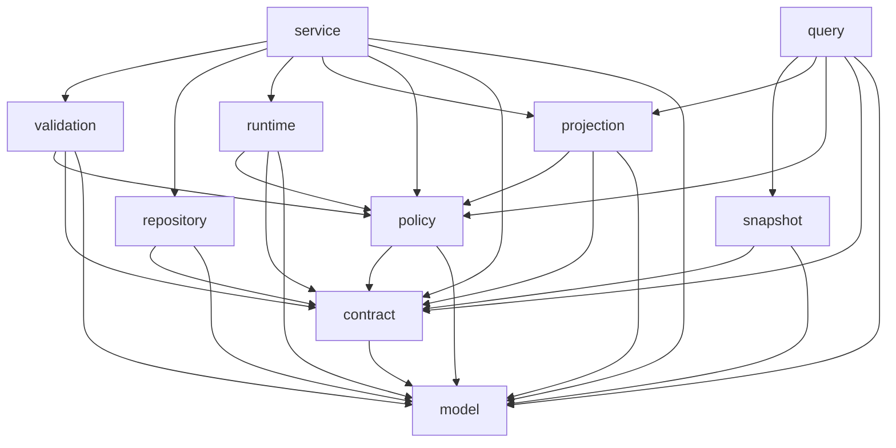

# Domainry 后端开发指导

本文是 `docs/architecture` 下长期保留的后端开发与架构实施指南，是 Builder、Runtime 与 Domainry Plane 的单一权威开发入口。本文统一规定产品边界、架构分层、Runtime DDD 落位、Control Plane pipeline、目录与分包、package/文件/类型命名、依赖方向、开发流程、迁移案例和验证门禁；不得在清理阶段性文档或 `docs/todo` 时删除。

发生冲突时，先修正本文和机器门禁使其与真实进程边界一致，不允许 Runtime、Control Plane 或局部 package 各自形成独立标准。

## B1. 适用范围与权威关系

本文覆盖：

- `runtime`：可独立部署、可复用的业务执行 Runtime；
- `internal/controlplane`：Domainry Plane 的无状态定义、编译和交付控制面；
- `internal/builder`：CLI、项目构建、物化、校验与交付客户端；
- `internal/testsupport`：只能被测试使用的仓库级 fixture/support；
- 各 owner 之间的依赖、合同、开发和迁移边界。

两者必须采用不同的组织原则：

- Runtime 使用 `domain/application/infrastructure`、业务 owner 和 pragmatic DDD；
- Control Plane **不套用 DDD 分层**，按 authoring/validation/compiler/projection/delivery 等确定性 pipeline stage 组织；
- Builder 按项目交付阶段组织，允许依赖 Control Plane 的稳定合同和确定性编译能力，但不得依赖 Runtime implementation；
- 本文 `R*` 章节只适用于 Runtime；Control Plane 遵循本文 `B*` 全仓边界，并由 `internal/controlplane` 的技术布局测试约束目录、依赖与命名。

规范优先级：

1. 本文 `B*` 规定全仓产品、进程和共同依赖边界；
2. 本文 `R*` 规定 Runtime DDD、目录、命名、依赖和开发细则；
3. [`module-saas-development-standard.md`](module-saas-development-standard.md) 规定独立能力仓库、SDK、Module/SaaS 双形态与 Runtime 接入细则；各能力现状登记在 [`../modules`](../modules/README.md)；
4. Control Plane 专项指导规定 pipeline 内部细则；
5. architecture tests 是可执行门禁，必须与本文一致；
6. reviewed legacy baseline 只是只减不增的迁移清单，不是新代码范例。

## B2. Runtime 与 Control Plane 职责边界

| 能力 | Runtime | Control Plane |
| --- | --- | --- |
| 业务数据与执行状态 | 唯一持有方 | 禁止持有 |
| Object/Action/Workflow 等可执行合同 | 定义执行真相和运行校验 | 引用、组合和编译 |
| Domain Blueprint | 不依赖 | 输入合同与编译流水线 |
| Authoring Contract/Schema | 提供 Runtime 公开能力事实 | 聚合并发布 authoring 入口 |
| Foundation Model | 提供被引用的 Runtime 领域事实 | 投影平台实体与关系，不持有运行状态 |
| 数据库、Connector、Identity Provider、Plugin | 具体实现持有方 | 禁止直接持有实现 |
| HTTP | 业务执行 API | 定义、编译、Foundation、交付 API |
| 前端页面、布局、视觉与源码路由 | 不持有设计事实 | 不持有设计事实；delivery 只校验源码交付身份与 artifact |

硬边界：

- Runtime 生产代码 **MUST NOT** import `internal/controlplane`；
- Runtime 和 Control Plane 生产代码 **MUST NOT** import `internal/builder`；
- Builder 只允许 import Runtime 稳定 domain contract/model/validation 与 platform leaf，**MUST NOT** import Runtime `application`、`bootstrap`、`infrastructure` 或 `transport` implementation；
- Control Plane **MAY** import Runtime 稳定 `domain/model/contract` 等公开合同；
- Control Plane **MUST NOT** import Runtime `application`、`bootstrap`、`transport` 或 `infrastructure` implementation；
- Control Plane 不得通过文件、数据库或进程内对象读取某个 Runtime 实例的运行状态；
- 两个进程的集成通过版本化 JSON/OpenAPI/artifact 合同完成，不通过跨进程内部 package 假共享。

## B3. 后端目标目录

```text
cmd/
└── domainry-cli/             # local project developer CLI entrypoint
internal/
├── builder/                     # CLI、项目构建、物化、校验与交付客户端
│   ├── backendmodel/
│   ├── projectmaterializer/
│   ├── projectstate/
│   └── sourcefinalizer/
├── controlplane/
│   ├── auth/                    # Domainry Plane request signing contract
│   ├── authoring/               # definition 与 document validation
│   ├── blueprint/               # input model、validation、compiler、projection
│   │   └── compiled/            # 中间 Manifest
│   ├── foundation/model/        # Foundation Model projection
│   ├── productbrand/            # Control Plane product brand projection
│   ├── projectdelivery/contract/# Project Delivery stable contract
│   ├── delivery/                # manifest 与 artifact service
│   └── transport/http/          # Control Plane HTTP adapter
├── runtime/
│   ├── cmd/                    # Runtime executable entrypoints
│   ├── bootstrap/              # 唯一 process composition root、transport wiring、lifecycle
│   ├── application/            # use case、application port、跨 domain 编排、seed
│   ├── domain/<owner>/         # Runtime-owned model、rule、service 和 port
│   ├── infrastructure/         # persistence、connector、provider、plugin adapter
│   ├── platform/               # 无业务语义的 Runtime 通用机制
│   └── transport/              # HTTP/provision 入站协议
└── testsupport/                 # 仅测试 fixture/support
```

Control Plane 不建立 DDD `domain/application/infrastructure` 对称层。外部协议只进入 `transport`，文件交付副作用只进入 `delivery`，其余目录必须对应可验证的 pipeline stage。

`internal/` 顶层目录必须严格只有 `builder`、`controlplane`、`runtime`、`testsupport`；新增微型职责时必须放入现有 owner 内，不能重新制造横向顶层 package。`internal/builder` 拥有 V6 CLI 所需的 bounded Action/Connector coding context、严格 archive decoder、build/module lock、managed Runtime process、项目状态、后端物化、验证和打包边界；它可以调用 Control Plane 的稳定合同和确定性编译 pipeline，并读取 Runtime 稳定 domain contract/model/validation 与 platform leaf，但不得 import Runtime `application`、`bootstrap`、`infrastructure` 或 `transport` implementation。完整 Snapshot → Domain Source 编译只存在于 Domainry Plane，CLI 只信任签名 Project Delivery、materialization receipt 和严格解码的 server artifact。项目可以独立包含前端输入，但 Project Delivery 只携带 Project Contract、Runtime manifest、Domain Source、backend-only Project Source Seed 和 backend-only Project Template。服务端 Domain Source 的 `generated/...` 物化为 `backend/generated/...`；Builder 只拥有 `backend/` 和 `.domainry/builder/` 的后端状态，永不创建、复制、删除或接管 `frontend/**`、前端 component contract 或 Runtime Client SDK。CLI 在 `backend/` 解析锁定的 Runtime `go.mod` 依赖、执行 local finalization、vet/test/package，并从 `backend/cmd/runtime` 构建项目专属 binary；不存在通用 backend binary 下载或本地 `domain generate` fallback。所有状态写入、artifact 校验、CAS、恢复和回滚必须由 V6 versioned contract/receipt 证明，不能依赖 stdout/help probe、仓库 Skill 副本或未发布 V5 状态。

仓库内 `examples/` 是项目源码的可复制命名参考，不是按“source-owned”所有权形容词另造的分类层。Action 示例必须使用 `examples/actions/<action_key>.go`、声明 `package actions`，文件名对应一个明确 Action；Connector 示例必须使用 `examples/connectors/<connector_key>/<provider_key>/<connector_key>_<provider_key>_adapter.go`，package 名按生成器对 `provider_key` 的规则规范化，文件内自有的顶层类型、常量、构造函数和私有 helper 必须统一携带 `<Connector><Provider>` owner，例如 `ProjectDeliverySandboxAdapter`。禁止使用 `sourceownedactions`、`sourceownedconnector` 这类压缩所有权短语的目录，禁止用 `handlers.go` 聚合多个无关 Action，也禁止在示例中声明脱离目录就失去 owner 的 `adapter.go`、`Adapter`、`ConnectorKey` 或 `adapterState`。已发布 Project Delivery 的 Connector source-path 合同若要从 `adapter.go` 迁移，必须另立兼容迁移批次，不得夹带在 `internal/` owner 收口中暗改。

P7 最终依赖验收进一步收紧前述局部 Runtime lock：项目 `go.mod` 不允许任何 dependency `replace`；项目 `go.work` 只能 `use .` 且不能 replacement，不能保留其他本地 module fork；最终 module graph 与 package module inventory 都必须没有 replacement。`go mod verify` 在 build/test 前后执行，确保实际进入闭包的所有 module cache 源码与 `go.sum` 一致。项目 Go owner 固定为 `actions/cmd/connectors/domain/generated`，禁止根级 Go、`internal/` copy、`vendor/` source 或另建 fork owner；这项是构建边界，不以源码相似度猜测替代可执行证据。

P7 最终 traceability contract 是 `domainry-project-artifact-bundle-v4`。Builder bundle 必须携带 signed manifest 中固定的 `verification-receipt.json` artifact，且只能包含后端 Runtime binary、后端 contracts、receipts、SBOM 与 provenance；前端项目独立携带和发布自己的源码、dist、component contracts 与 Runtime client 依赖。该 receipt 是完整后端输入事实载体，provenance 以 resolved dependency 绑定其 SHA-256，并使用 `project-artifact/v4` build type。离线 verifier 严格解码 receipt，交叉校验 manifest identity/toolchain/target/tags，验证 Snapshot/public contracts、source inventories、Handler revision 和 passed checks 完整；provenance 的 Go module dependency 还必须与 SPDX `pkg:golang` identity 一一对应，主 module 统一绑定 Project source hash。

P8 的调用者业务身份不得来自普通请求字段。Runtime 将已经解析并授权的当前 `ActiveBusinessProfile` 复制进公共 `runtimeext.Principal`，generated SDK 再通过每个 Action 自己的 `<ActionName>Execution.Principal()` 暴露 detached `capabilities.Principal`；项目 Handler 依据 `BindingKey/ObjectKey/RecordID` 派生 typed 业务记录 ID。项目不能取得 Runtime 内部 Profile、claims 或 authorization model，也不能通过修改 generated 副本影响 Runtime Principal。替他人操作使用 optional typed Booker override，并在项目 Action 中只对明确的管理员/前台角色授权；普通会员只允许当前 Profile 路径，不能提交任意记录 ID。选定 Booker 后，项目 Action 通过 generated Member capability 读取本地黑名单事实并在任何 Connector/Mutation 前稳定拒绝，Runtime 不包含 gym 黑名单分支。

Project package build 通过固定 linker symbol 把 receipt、Project input/source、Generated SDK、Handler catalog、signing key ID/public-key hash 与 canonical public key 写入目标 binary，绝不写入私钥。`runtimehost` 在 Handler/Connector registry freeze 后按公开 descriptor 计算两项 registry hash，并与 Runtime/public contract、Domain SDK/Snapshot 和 package linker facts 规范编码为 `domainry-runtime-release-identity-v2` 的 `combination_sha256`。该只读身份沿 `runtimehost -> bootstrap/runtime -> bootstrap/transport -> HTTPRouter` 单向传递，由匿名 `/ready` 和管理员 `/health` diagnostics 同时发布；未 package 的本地进程明确发布 `build_mode=development` 和空 package facts，不能伪装成已签名 release。

项目 Runtime 打开并验证共享数据库后、执行任何 Metadata restore/seed 或 HTTP binding 前，必须通过 installation-scoped `_release_cohorts`/`_release_instances` 原子加入 active release cohort。live instance 存在时 Runtime、Project、Snapshot、Generated SDK 和冻结后的 Handler/Connector Registry 完整 identity 必须逐字段相同；没有 live lease 时才能递增 generation 并切换 cohort。租约使用 serializable transaction、45 秒 TTL 和 15 秒 heartbeat，heartbeat 同时 fence instance ID、combination hash 与 generation。clean host shutdown 使用 caller lifecycle context 立即释放，crash 等待 expiry；heartbeat 丢失会不可逆关闭本进程业务流量 admission 并使 `/ready` 的 `release_cohort` critical check 失败，不能在数据库恢复后自行重新开放。

Packaged Runtime 在加载配置和打开数据库前，必须从 executable 同目录读取 `*.attestation.json`，重算当前 executable checksum/size，逐项比较编译期 Project identity，并用编译期 canonical public key 验证 Ed25519 signature；缺失、格式错误、binary 漂移、identity 漂移或 signature 漂移直接终止启动。进入 Runtime 后，`/ready` 以四个独立 critical check 发布 `release_build`、`release_signature`、`release_schema`、`release_registry`：前两项保留启动时不可变证据，Schema 将 Metadata restore 后建立的持久 schema revision 与每次探测时数据库当前 revision 比较，Registry 从同一冻结 Handler/Connector descriptor inventory 重新计算 hash。任一不一致都不得 ready。开发模式明确不声称 package/signature 验证，Generic Runtime 没有 project Snapshot 时不错误启用项目 Schema/Registry 门禁。

`domainry lint` 是项目业务源码的独立准入入口。它扫描 `actions/`、仅在真实复用复杂度出现时才允许存在的 `domain/`，以及 `connectors/` 生产 Go 文件。Action/domain 禁止 Runtime、SQL/persistence、worker、直接网络和任意第三方 import，同时禁止 raw `ObjectKey`/`FieldKey` identifier、`map[string]any`（包括空 interface 与同 package 跨文件 alias）、原始 persistence call 和 SQL literal；Action 可以单向 import 可选 domain，domain 不得反向 import Action/capability/Connector。Connector 只允许纯标准库、项目 Connector/generated 类型和 `connector`，且 Adapter constructor 必须接收 Runtime 注入的 `connector.Transport`；未经显式审核的第三方包默认拒绝。测试 fixture 不进入生产边界。Domain materialization 必须在移动旧 generated tree 之前执行同一门禁，不能只依赖开发者主动运行 CLI。

每个 Action 的 `generated/docs/<action>.md` 只能描述该 Action 的 typed input/output、获权 Object operation 与 Connector operation；`generated/context/<action>.json` 使用版本化合同固定 focused read order、相关路径和符号。它们不能列入未获权 Object/Connector，也不能引导模型加载 Runtime internal。是否让模型默认严格按该 pack 读取属于独立的模型工作流门禁，不能用“已经生成 pack”替代。

模型读取项目 Action 上下文必须通过 `domainry action context --projection coding --project <root> <action-key>`。该命令先验证 Domain Source manifest 的精确 bytes 仍受当前 materialization receipt 约束，再校验 `backend/generated/schema/revision.gen.go` 的 Snapshot/contract/generator identity；它只读取 pack 声明且由 Action 权限事实推导出的 docs、capability、object schema、Connector API 和用户 Handler/test，不提供任意路径、目录递归或 Runtime source fallback。每文件上限 1 MiB、总上下文上限 4 MiB；完整合同继续在缓存中按 digest 保存，不默认进入模型上下文。Schema 演进后的标准修复链是 `project delivery audit/repair -> 编译失败定位 backend/actions/*.go 旧符号 -> bounded action context/go doc -> 只修用户 Handler/test -> source finalize -> verify`，不得修改 server-owned generated 文件或为旧字段保留 alias。

项目 Connector constructor 固定为 `New*Adapter(connector.Transport) Adapter`。generated composition 保存的是 `connector.ProviderSetFactory`，由 `runtimehost` 在 Provider Registry 冻结前注入唯一 Runtime-owned Transport。项目 Adapter 只能通过该闭合端口执行受限 HTTP 或外部 SQL，不得自行创建网络客户端、连接本地 SQLite、访问 Runtime 数据库、注册 route/worker，或 import Runtime internal。该端口是进程内能力收口，不等于安全沙箱；项目源码 lint 与生成期 AST 门禁必须共同拒绝旁路。

## B4. 全仓依赖方向

```text
Runtime:
cmd -> bootstrap -> application/transport/infrastructure
transport -> application public boundary/domain/platform
application -> domain/platform abstraction
infrastructure -> domain port/platform
domain -> domain leaf contract/platform abstraction
platform -> standard library/leaf platform contract

Control Plane:
transport/http -> authoring/blueprint/foundation/delivery
authoring -> authoring/spec + blueprint public contract
foundation -> Runtime public domain contracts
blueprint -> blueprint/compiled + Runtime public domain contracts
delivery -> standard library filesystem boundary

Builder:
cmd/domainry-cli -> builder -> controlplane stable contracts/pipeline + public pkg contracts
```

共同禁止项：

- `domain -> application/transport/infrastructure implementation`；
- `application -> transport/infrastructure implementation`；
- `platform -> domain/transport/infrastructure implementation`；
- `transport -> persistence implementation`；
- `infrastructure -> transport implementation`；
- Control Plane 非 transport pipeline stage -> `net/http`；
- 任意层新增 `common/utils/shared/library` 作为循环依赖出口。

Runtime owner 内和跨 owner 的精确依赖矩阵见 R3。

## B5. Control Plane pipeline 开发规则

Control Plane 不识别 Aggregate、Repository、Domain Service 或 Application Service。目录表示数据变换阶段，不是领域 owner：

| Pipeline stage | 输入 -> 输出 |
| --- | --- |
| `authoring/definition` | V3 Go input model -> JSON Definition/Connector Definition |
| `authoring/validation` | 完整 JSON document -> deterministic diagnostics |
| `blueprint/model` | JSON -> strict typed Blueprint |
| `blueprint/validation` | typed Blueprint -> invariant/coverage result |
| `blueprint/compiler` | typed Blueprint -> normalized/pruned compilation state |
| `blueprint/projection` | compilation state -> intermediate/Runtime Manifest |
| `foundation/model` | Runtime public capability facts -> Foundation Model |
| `delivery` | delivery manifest/artifact input -> validated filesystem result |
| `transport/http` | HTTP protocol <-> pipeline entrypoint |

拆包只要求 stage 有明确输入、输出、调用方向和测试闭包，不要求套用 Entity/Value Object/Aggregate/Repository/Service。Blueprint compiler 只能确定性生成 Runtime 可安装合同，不执行 Runtime 业务；Foundation 只读取 Runtime public contracts，不探测 Runtime implementation。

## B6. 全仓迁移与验收

拆 package 的前提是生产代码形成可独立描述、无循环、可独立测试的依赖闭包。只有一个微型文件、receiver 必须留在原包、私有符号形成大 SCC，或拆分会迫使下层依赖上层时，不得为了目录形式强拆。

每批迁移必须：

1. 统计文件、imports、receiver、私有符号和测试；
2. 识别 SCC、owner 或 pipeline stage；
3. 先移动无循环叶子，再移动 service/composition；
4. 实现与测试同批迁移，不夹带无关业务重写；
5. 更新调用方、contract assertions、architecture tests 和 inventory；
6. 收紧 reviewed legacy baseline；
7. 运行与风险匹配的 focused、全层、vet、build、race/smoke/golden 验证。

全仓基础验收：

```bash
go test ./runtime/...
go test ./internal/controlplane/...
go test ./internal/builder/...
go test ./...
go vet ./runtime/...
go vet ./internal/controlplane/...
go vet ./internal/builder/...
go build ./...
git diff --check
```

完成态必须同时证明：进程所有权清晰、依赖无反向 implementation import、Domain/Application/Bootstrap/Transport/Infrastructure 各归其位、Control Plane stages 不混写、稳定 JSON/OpenAPI/Manifest/权限合同兼容、architecture inventory 与真实目录一致，并且不存在“测试通过但旧大包仍是事实 owner”的伪完成。

## R1. 规约级别

本文档是 `runtime` 的强制开发与架构指导，适用于新功能设计、生产代码、测试代码、新 package、现有 package 迁移和代码审查。

规则关键词：

- **MUST**：必须满足；优先由类型系统与 owner package tests 检查，跨 package 依赖规则由精简的 `runtime/boundary` tests 检查。
- **MUST NOT**：禁止；违反时 CI/Go test 必须失败。
- **SHOULD**：默认必须遵守；只能在有具体依赖或 Go receiver 证据时例外。
- **Reviewed legacy baseline**：现有违反项的精确白名单或数量上限；只能减少，不得增加。

规约本身的更改必须与架构测试同批审查；不得仅为让新违规代码通过而放宽白名单或基线。

## R2. Runtime 顶层边界

`runtime` 顶层 **MUST** 只包含：

```text
runtime/
├── application/     # 用例服务、跨领域业务编排和应用端口
├── domain/          # Runtime-owned 业务模型、规则、服务和 port
├── cmd/             # 可执行进程入口
├── bootstrap/       # 唯一进程装配根、transport wiring 和生命周期
├── infrastructure/  # 数据库、外部系统和具体 adapter
├── platform/        # 不含具体业务语义的 Runtime 通用机制
└── transport/       # HTTP/provision 等入站协议适配
```

Runtime 根目录 **MUST NOT** 存在生产 Go 文件；只允许 `*_test.go` 架构契约测试。

依赖方向：

```text
cmd -> bootstrap -> application/transport/infrastructure
transport -> application public boundary/domain/platform
application -> domain/platform abstractions
infrastructure -> domain port/platform
domain -> domain leaf contracts/platform abstractions
platform -> standard library or platform leaf contracts
```

禁止：

- `domain -> application/transport/infrastructure implementation`
- `application -> transport/infrastructure implementation`
- `platform -> domain/transport/infrastructure implementation`
- `transport -> persistence implementation`
- Runtime 生产代码 `-> internal/controlplane`

## R3. Domain 目录和技术子包

### R3.1 业务 owner 优先

第一层 **MUST** 是真实业务 owner：

```text
domain/<owner>/
```

**MUST NOT** 建立全局 `domain/service`、`domain/repository`、`domain/validation`、`domain/model` 等横向技术大包。

### R3.2 owner 内二级技术职责

大型 owner 仅允许以下二级技术目录：

| 目录 | 职责 | 允许依赖 |
| --- | --- | --- |
| `model` | 纯结构、枚举、DTO、叶子契约 | 其他叶子 model/contract |
| `validation` | 业务校验、规范化、issue 定位 | model/contract/policy |
| `service` | 单 owner 业务行为与生命周期入口 | repository/validation/runtime/projection/policy/contract/model |
| `query` | 大型 owner 的只读查询、聚合与分页执行入口 | snapshot/projection/policy/contract/model |
| `snapshot` | 大型 owner 的物化快照 claim、刷新与 fencing 生命周期 | contract/model |
| `repository` | owner 持有的持久化 port | model/contract |
| `runtime` | executor、worker、dispatcher、engine | model/contract/policy |
| `projection` | snapshot、view、permission/i18n/read model | model/contract/policy |
| `policy` | 权限、状态机、业务策略 | model/contract |
| `contract` | 跨包稳定 port 和 capability contract | model/leaf contract |
| `testdata` | fixture/golden data | 无生产 Go package |

`query` 和 `snapshot` 只用于已经形成独立测试闭包的大型 owner；不得把普通 service 文件按读写名称机械分包。`query` 只允许通过稳定合同读取数据，`snapshot` 只拥有物化生命周期；二者不得相互成环。

`model`、`validation`、`repository`、`projection`、`policy` **MUST NOT** 反向引用同 owner `service`、`query` 或 `snapshot`。

小 owner **SHOULD** 保持平铺，不为一个文件创建微型子包。

### R3.3 owner 内技术包依赖图

下图箭头表示“左侧 package 可以 import 右侧 package”。依赖必须始终从行为编排指向叶子合同，不得为了复用 helper 反向引用：



精确矩阵：

| Source package | 可以 import | **MUST NOT** import |
| --- | --- | --- |
| `model` | 标准库、同/其他 owner 的稳定 leaf `model`/`contract` | `validation/service/repository/runtime/projection/policy`、Application/Infrastructure/Transport |
| `contract` | `model`、无实现的 leaf contract | `service/repository/runtime` 和任何 adapter implementation |
| `policy` | `model/contract` | `service/repository/runtime/projection`；Policy 不执行 I/O |
| `validation` | `model/contract/policy` | `service/repository/runtime/projection`；校验不得读取数据库来掩盖 use case |
| `repository` | `model/contract` | `service/validation/runtime/projection/policy` 和 Infrastructure implementation |
| `projection` | `model/contract/policy` | `service/repository/runtime`；读取所需数据通过输入或 projection port 提供 |
| `runtime` | `model/contract/policy` | `service/projection` 和具体 Store/Connector；执行所需 I/O 通过 `contract` port 注入 |
| `service` | 同 owner 的 `model/contract/policy/validation/repository/projection/runtime` | Application、Transport、Infrastructure implementation、其他 owner 的 `service` |
| `query` | 同 owner 的 `model/contract/policy/projection/snapshot/query` | Application、Transport、Infrastructure implementation、repository implementation、其他 owner 的行为包 |
| `snapshot` | 同 owner 的 `model/contract/snapshot`；查询执行通过 `contract` port 注入 | `query/service/repository/runtime/projection` 和具体 Store implementation |

补充规则：

- 同层 sibling package **MUST NOT** 相互成环，例如 `validation -> policy -> validation`。
- `service` 是 owner 内的最上层行为入口，不得被 `model/repository/policy/...` 反向依赖。
- `repository` 只定义持久化 port。即使 interface 当前只有一个 SQL 实现，也不得把实现移动进 Domain 来减少 wiring。
- `runtime` 需要持久化或外部调用时，在 `contract` 定义最小能力 port；不得直接 import `repository` 或具体 adapter。只有明确属于 aggregate 持久化的能力才进入 `repository`。
- `projection` 若需要查询数据，由 Application/Service 注入 read port 或输入快照；不得自行打开数据库。

上述矩阵是 owner 完成二级目录迁移后的强制目标。尚未迁移的 owner 根包及其跨 owner root import 属于 reviewed legacy，只能随迁移减少；owner 根包生产文件基线归零后，不得再用 legacy 名义增加反向依赖或跨 owner Service import。

### R3.4 跨 owner 依赖

跨 owner 默认只允许依赖稳定叶子合同：

```text
domain/<owner-a>/{service,policy,validation,...}
    -> domain/<owner-b>/model
    -> domain/<owner-b>/contract
```

以下规则强制适用：

- owner A **MAY** import owner B 的 `model/contract`，前提是语义稳定、方向单向且不会产生 import cycle。
- owner A **MUST NOT** import owner B 的 `service`、`repository`、`runtime` 或 Infrastructure adapter。
- 一个 use case 需要同时调用两个 owner 的行为入口时，编排 **MUST** 位于 Application Service；不得把 owner B 的 Service 注入 owner A 的 Service。
- owner A 只需要 owner B 的一个能力时，优先在真正消费该能力的一侧定义最小 port，由 Bootstrap 绑定实现；不得依赖对方整个 Service。
- 跨 owner 写入必须明确事务/Outbox/compensation 边界。import 能通过编译不代表业务一致性边界正确。

### R3.5 Runtime 跨层依赖矩阵

| Source layer | 允许直接依赖 | 禁止直接依赖 |
| --- | --- | --- |
| `cmd` | `bootstrap` public start boundary | Domain/Application/Store/Handler 的具体组装细节 |
| `bootstrap` | Application、Domain public boundary、Transport、Infrastructure、Platform | Control Plane；Bootstrap 内实现业务规则 |
| `transport` | Application public boundary、Domain `model/contract`；经审核的单 owner Domain public boundary；Platform protocol mechanism | Bootstrap、Infrastructure、Store、SQL/driver |
| `application` | Domain public boundary、Platform abstraction | Bootstrap、Transport、Infrastructure implementation |
| `infrastructure` | Domain `model/contract/repository`、Platform mechanism、Infrastructure leaf packages | Application Service、Domain Service、Transport |
| `domain` | 标准库、Domain leaf `model/contract`、Platform abstraction | Application、Bootstrap、Transport、Infrastructure implementation |
| `platform` | 标准库和其他无业务语义的 Platform leaf contract | Domain、Application、Transport、Infrastructure implementation |

Transport **SHOULD** 优先调用 Application public boundary。只有不涉及跨 owner 编排、事务或副作用顺序的单 owner 只读入口，才可以经过明确审核直接调用 Domain public boundary；Transport 仍不得持有 Domain Service 的构造和 wiring。

### R3.6 正例

#### 正例 A：Domain Service 依赖自己的 model 和 Repository port

```go
package service

import (
    auditmodel "github.com/domainry/domainry-audit-sdk/contract"
    auditrepository "github.com/domainry/domainry-audit-sdk/application"
)

type AuditDomainService struct {
    repository auditrepository.AuditRepository
}

func NewAuditDomainService(repository auditrepository.AuditRepository) *AuditDomainService {
    return &AuditDomainService{repository: repository}
}
```

原因：`service -> repository/model` 单向；Domain 只看到 port，不知道数据库实现。

#### 正例 B：Bootstrap 绑定 Domain port 与 Infrastructure Store

```go
package bootstrap

import (
    auditrepository "github.com/domainry/domainry-audit-sdk/application"
    auditpersistence "github.com/domainry/domainry-runtime/runtime/infrastructure/persistence/database/audit"
)

var _ auditrepository.AuditRepository = auditpersistence.AuditStore{}
```

原因：只有 composition root 同时知道 abstraction 与 implementation；编译期 assertion 验证 adapter 合同。

#### 正例 C：跨 owner 由 Application 编排

```go
package composition

type OrderSettlementApplicationService struct {
    orders   OrderSettlement
    payments PaymentCapture
    outbox   EventPublisher
}
```

原因：Order 与 Payment 保持独立 owner；Application 只决定调用和副作用顺序，业务合法性仍由各 Domain owner 判断。

#### 正例 D：Infrastructure Store 只依赖叶子合同

```go
package audit

import (
    "context"

    auditmodel "github.com/domainry/domainry-audit-sdk/contract"
)

func (s AuditStore) InsertAuditEvent(ctx context.Context, event auditmodel.AuditEvent) error {
    // SQL mapping only; no permission or audit policy decision here.
    return nil
}
```

原因：Infrastructure 可以消费 Domain model 来实现 port，但不依赖 Domain Service，也不决定业务规则。

### R3.7 反例与改法

#### 反例 A：Model 反向依赖 Service

```go
package model

import auditservice "github.com/domainry/domainry-audit-sdk/application"
```

问题：叶子模型反向依赖行为入口，必然放大循环。**改法**：把纯结构留在 `model`；真正共享的能力抽成 `contract`，由 `service` 依赖它。

#### 反例 B：Domain 直接依赖 Store

```go
package service

import auditstore "github.com/domainry/domainry-runtime/runtime/infrastructure/persistence/database/audit"

type AuditDomainService struct {
    store auditstore.AuditStore
}
```

问题：Domain 被 SQL implementation 锁定，测试和方言替换都穿透领域边界。**改法**：依赖 `audit/repository.Repository`，由 Bootstrap 注入 `AuditStore`。

#### 反例 C：Transport 直接查询数据库

```go
package reports

import recordstore "github.com/domainry/domainry-runtime/runtime/infrastructure/persistence/database/record"
```

问题：HTTP 绕过权限、事务、审计和 use case。**改法**：Handler 直接依赖对应 owner 的 concrete Application Service；实例通过 Bootstrap wiring 提供。

#### 反例 D：owner Service 直接调用另一个 owner Service

```go
package service // domain/order/service

import paymentservice "github.com/domainry/domainry-runtime/runtime/domain/payment/service"

type OrderDomainService struct {
    payments *paymentservice.PaymentDomainService
}
```

问题：两个 owner 的 lifecycle、事务和错误语义被硬耦合，并容易形成双向 Service import。**改法**：跨 owner use case 移到 Application；如果只是单一 capability，则注入最小 `PaymentAuthorizer` port。

#### 反例 E：用 `common` 消除循环

```text
domain/order/service -> domain/common
domain/payment/service -> domain/common
```

问题：循环没有被建模，只是被隐藏在无 owner 大包中。**改法**：识别真正拥有该概念的 owner；稳定数据进入该 owner 的 `model/contract`，跨 owner 流程进入 Application。

#### 反例 F：Application 构造具体 Store

```go
package composition

func NewOrderApplicationService(db *sql.DB) *OrderApplicationService {
    store := orderpersistence.NewOrderStore(db)
    // ...
}
```

问题：Application 同时承担 use case 与 composition root。**改法**：Application 构造函数只接收 port；数据库和 Store 的构造统一放在 Bootstrap。

### R3.8 新增 import 的审查顺序

新增 Runtime 内部 import 前按顺序回答：

1. Source package 的 owner 和技术角色是什么？
2. Target 是 leaf contract、业务行为还是具体实现？
3. 该依赖是否符合上面的精确矩阵？
4. 跨 owner 时，为什么不能由 Application 编排或最小 port 隔离？
5. 是否产生直接或间接 cycle？是否为了拆文件扩大了符号可见性？
6. 该边界由哪个 unit/contract/integration test 证明？

任一问题无法回答，不得先增加 import 再用 architecture allowlist 放行。

### R3.9 Audit 可复用模块案例

Audit 已从 Runtime/Identity 的本地业务 owner 中剥离，公共业务能力由两个源码仓库负责：

- `domainry-audit-sdk/contract`：稳定事件、查询、Surface、导出及事务 port。
- `domainry-audit-sdk/application`：泛型宿主 Application Service，统一事件构造、脱敏、权限回调、查询、Surface 投影和导出编排。
- `domainry-audit`：模块内部 Domain/Application/Persistence 及 source-owned migrations。

宿主只允许保留适配代码：

```text
runtime/application/auditbinding/                 # Principal/权限 Policy 适配
runtime/infrastructure/persistence/auditmodule/   # Host DB、事务和迁移 registrar 适配
```

Runtime、Identity **MUST NOT** 再声明自己的 `domain/audit`、`application/audit`、Audit Repository port、Audit Domain Service 或迁移账本。业务调用依赖 SDK contract/application；Bootstrap 只负责把模块 Binding、宿主 Policy、事务 Store 组装起来。

数据库规则：

- Audit 模块使用宿主 Database、Dialect、Transaction、Migration lock 和全局 `_schema_migrations`。
- Audit source module 提交自己拥有的 migration；宿主不得复制 Audit DDL/DML。
- 持久化 DDL/DML 使用 `github.com/domainry/domainry-orm`；没有 ORM 等价能力时才允许带本地理由和方言测试的原生 SQL。
- 当前 source-owned 表为 `_audit_events` 与 `_audit_export_artifacts`，不得恢复 `business_audit_export_artifacts` 或模块私有迁移账本。

完成态门禁必须同时证明：

1. Runtime/Identity 不存在本地 `domain/audit` 和 `application/audit`。
2. 不存在旧 standalone host、模块私有 migration ledger 和旧表生产引用。
3. SDK、Audit、Identity 全量测试通过；Runtime 的 Audit focused tests 和 Audit architecture gates 通过。
4. 宿主 adapter 不包含 Audit 权限、Surface、导出或持久化业务规则。
## R4. Application 与 Bootstrap 目录

Application **MUST** 只负责业务用例编排：

- 单个或跨 owner 的 use case/application service；
- application port 和跨领域事务编排；
- 真实跨 owner 编排；
- seed 归并、安装和 materialization；
- contract compile check；跨 owner 的完整 Runtime integration test 由 Bootstrap 持有。

Application **MUST NOT** 定义 `App`/`Application` 进程聚合对象，不得依赖 transport 或 infrastructure implementation，也不得持有配置、数据库连接、HTTP Server、Routes、worker 生命周期或协议切换器。Application 同样不得新建 `model`、`validation`、`repository`、`policy` 业务技术包。

Application **MUST NOT** 声明 `*Repository` 持久化接口。Repository 是对应 Domain owner 的持久化契约：Application 通过 Domain Repository 访问聚合状态，Infrastructure 实现契约，Bootstrap 完成实现绑定。Application 自有的非持久化协作边界必须按实际职责命名，不得用 `Repository` 伪装。

Bootstrap 是唯一 composition root，负责构造 `bootstrap.Runtime`、读取进程配置、连接 infrastructure adapter、绑定 transport，并管理 worker 和关闭生命周期。Bootstrap 可以依赖 application、domain、transport、infrastructure 和 platform，但不得实现业务规则。

目标目录：

```text
application/
├── identity/              # Identity 安装、seed、权限 materialization
├── integration/           # Integration 安装用例
├── seed/<capability>/
└── contractcheck/

bootstrap/
├── bootstrap.go                       # 稳定公开 facade；只转发到 runtime/transport
├── composition/                       # Application Service 与 Adapter 组装
├── runtime/                           # 进程状态、构造、启动、恢复、seed、worker、关闭
├── transport/                         # HTTP Router、Handler 与入口协议 wiring
├── testkit/                           # Bootstrap 测试 wiring/fixture
└── integrationtest/                   # 完整 Runtime、HTTP 与跨 owner 测试

domain/manifest/testdata/manifests/       # 共享 Manifest 测试夹具
```

Bootstrap 根包 **MUST** 只保留 `bootstrap.go` 公开 facade，不得重新堆放进程实现。`runtime/` 只能持有进程构造、配置、启动阶段、恢复、seed、worker 和关闭生命周期；`transport/` 只能持有 HTTP/Provision 等入站协议装配。两个子包均采用精确生产文件清单，新增未审核文件或嵌套目录必须触发架构门禁失败。

`composition` 内文件 **SHOULD** 使用 `<owner>_*_wiring.go` 表达 owner wiring，使用 `runtime_services_*` 表达私有完整构造图和最小公开 facade。业务 orchestration 必须回到 Application owner；只调用单一 owner 的业务代码也必须回到该 owner，不得伪装成 composition。

## R5. Transport 目录

Transport 顶层协议只允许：

```text
transport/http/
transport/provision/
```

HTTP 先按业务入口建 owner，再按以下技术文件职责整理：

| 文件 | 强制职责 |
| --- | --- |
| `<owner>_handler.go` | `<Owner>Handler`、`<Owner>Dependencies`、`New<Owner>Handler` 和通用 owner helper |
| `<owner>_routes.go` | 只声明该 owner 的 `RegisterRoutes`，不得混入 endpoint 实现 |
| `<owner>_request.go` | path/query/header/body 解析和 transport DTO |
| `<owner>_response.go` | response DTO 和 error/JSON 映射 |
| `<owner>_presenter.go` | business result 到 HTTP representation |
| `<owner>_middleware.go` | 该 owner 特有协议 middleware |
| `<owner>_adapter.go` | 仅在存在外部协议转换时使用；不得包装 concrete Application Service 制造本地 port |
| `<owner>_<resource>.go` | 一组同资源/use-case endpoint |

HTTP **MUST NOT** 持有 business validator、state machine、repository implementation 或跨 owner service composition。HTTP 中的 validation 只能校验协议形状。

`transport/http` 根包的进程内路由聚合类型 **MUST** 命名为 `HTTPRouter`，主文件使用 `http_router.go`；它只负责 Handler 路由聚合和协议中间件，不得命名为 `Server`。真正的 `http.Server`、监听、信号和 shutdown 生命周期归 `cmd/server`。

HTTP Handler 和 Dependencies **MUST** 直接依赖对应 owner 的 concrete `*ApplicationService`。`transport/http` **MUST NOT** 声明 `*ApplicationPort` 接口，也不得为了 mock 或缩窄方法集复制 Application Service 方法签名。需要替换的 Repository、provider、clock、transaction 等依赖在 Application/Domain 构造边界抽象，HTTP 测试通过真实 Application Service 或 Bootstrap integration fixture 验证。

每个 `transport/http/<owner>` **MUST** 同时存在 `<owner>_handler.go` 和 `<owner>_routes.go`。这里的 `<owner>` 取该 HTTP owner 目录名，确保文件离开目录后仍可全局检索，例如 `records/records_handler.go`、`records/records_routes.go`。生产和测试代码均 **MUST NOT** 再使用无 owner 前缀的 `handler.go`、`routes.go`、`handler_test.go`、`routes_test.go`。资源级 endpoint 可以继续拆为 `<owner>_<resource>_handler.go`，但不得取代 owner 主 Handler 文件。

`<owner>_handler.go` 只持有 Handler、Dependencies、构造函数和 owner 级通用协议 helper；`<owner>_routes.go` 只注册路由。新增 endpoint 必须进入带 owner 前缀的资源文件，不得为了减少文件数把路由注册重新塞回 Handler 文件。

HTTP owner 的 Go 标识符也必须携带具体业务名，不能因为 package 已表达 owner 就省略。目录名按业务词转换为 MixedCaps，复数 owner 保持复数，initialism 保持完整大写：`identity` 使用 `IdentityHandler` / `IdentityDependencies` / `NewIdentityHandler`，`records` 使用 `RecordsHandler`，`openapi` 使用 `OpenAPIHandler`。禁止声明通用的 `Handler`、`Dependencies`、`NewHandler`。

## R6. Infrastructure 目录

Infrastructure 顶层只允许：

```text
infrastructure/
├── connectors/
├── persistence/
└── plugins/
```

持久化结构：

```text
persistence/
├── driver/
├── database/<business-owner>/
├── sqlite/
├── mysql/
└── postgres/
```

规则：

- repository interface **MUST** 归 domain owner；Infrastructure 只实现接口。
- database owner adapter 文件 **MUST** 使用 `<owner>_store.go`、`<owner>_adapter.go`、`<owner>_scanner.go`、`<owner>_schema.go`；多 capability 时在 owner 与技术后缀之间加 capability。
- 方言目录 **SHOULD** 使用 `dialect.go`、`driver.go`、`migration.go`、`schema.go`。
- Connector 目录层级为 `connectors/<capability>/<provider>`；provider 实现不得进入 business。
- Infrastructure **MUST NOT** 引用 transport implementation。

## R7. Platform 目录

Platform 只允许 Runtime 自有、不能下沉到 Foundation 或业务 owner 的技术绑定。当前已审核 capability：

```text
config
localization
productbrand
```

通用错误、集合、锁、幂等、日志、mutation、request context、secret、telemetry、worker 等机制归 `domainry-foundation`。Admission controller、通用 health Check/Evaluate、rate limit 与安全 HTTP client 同样归 Foundation；Runtime 只保留 readiness 编排。Webhook 签名与 Notification provider-template binding 分别归 Connector provider 与 Notification module-host binding。Integration 抽离后的 `resilience` 残留不得恢复，后续仅按真实跨 SDK 合同重新设计。

新 Platform capability **MUST** 显式通过架构审查并更新机器清单。`common`、`utils`、`shared`、`library` 不是 capability，任何层级都禁止。

Platform **MUST NOT** 引用具体 domain owner、transport 或 infrastructure implementation。

## R8. Cmd 目录

```text
cmd/<command-name>/
```

- command 目录 **MUST** 使用 `lower-kebab-case`，例如 `openapi-audit`。
- command package **MUST** 为 `main`。
- `main.go` **MUST** 只处理参数、信号、启动和退出。
- 业务规则、repository 实现和 HTTP handler **MUST NOT** 位于 cmd。

## R9. 目录、package 和文件命名

### R9.1 目录

- 除 `cmd/<command-name>` 外，所有 Runtime 目录 **MUST** 使用 `lower_snake_case`。
- 目录名 **MUST** 表达 owner、protocol、adapter family 或明确 technical role。
- **MUST NOT** 使用 `common`、`utils`、`shared`、`library`、`misc`、`impl` 等兜底目录。

### R9.2 Package

- package 名 **MUST** 为紧凑小写词，默认为目录名移除下划线，例如 `request_context -> requestcontext`。
- `domain/<owner>/model` package **MUST** 为 `<owner>model`。
- `domain/<owner>/service`、`repository`、`validation`、`policy`、`runtime`、`projection`、`contract` package **MUST** 直接使用目录技术名；调用方发生重名时使用语义 import alias。可复用外部模块（如 Audit）直接依赖其 SDK，不得在宿主重建同名 Domain。
- `cmd/*` package **MUST** 为 `main`。
- 外部黑盒测试可使用 `<package>_test`。
- 目录/package 不一致只能作为精确 reviewed legacy exception，不允许新增。

Go package 名本身是调用表达式的一部分。新 API **SHOULD** 以 `package.Type`、`package.Function` 连读清晰为准，避免 `validation.ValidationResult`、`repository.RepositoryRepository` 等重复词。仓库保留 `*DomainService`、`*ApplicationService` 和 `*Store` 的显式层级后缀，是为了让大规模 Runtime wiring 和架构门禁能够仅从类型名判断所有权；这条仓库约定优先于省略上下文的通用 Go 建议。

### R9.3 Go 文件

- Go 文件 **MUST** 使用 `lower_snake_case.go`。
- 测试 **MUST** 使用 `*_test.go` 并与被测职责同包；黑盒合同测试才使用 `<package>_test`。
- 生产文件 **MUST NOT** 新增 `common.go`、`utils.go`、`helpers.go`、`misc.go`、`types.go`、`base.go`、`manager.go`、`impl.go`、`interfaces.go`、`repositories.go` 等模糊名称。
- 所有 owner 业务文件名 **MUST** 以 `<owner>_` 开头，使文件离开目录上下文后仍能全局检索和识别所有权，例如 `audit_append.go`、`record_validation.go`、`workflow_dispatcher.go`。测试文件沿用同一前缀。
- HTTP owner 的主入口和路由文件 **MUST** 分别使用 `<owner>_handler.go`、`<owner>_routes.go`；对应测试必须使用 `<owner>_handler_test.go`、`<owner>_routes_test.go`，禁止退回 `handler.go`/`routes.go`。
- 文件名 **MUST** 在 owner 前缀之后表达一个业务概念或明确技术职责，不按 CRUD 动词机械堆叠，也不以某个调用方命名。
- 一个 `*DomainService`、`*ApplicationService` 或导出的 concrete `*Store` 主文件 **MUST** 只拥有一个同类主类型。主类型名按 MixedCaps 转为文件名：`AuthDomainService -> auth_domain_service.go`、`AuthHTTPStore -> auth_http_store.go`、`IdentitySQLStore -> identity_sql_store.go`。
- 同一 receiver 的辅助文件 **SHOULD** 使用 `<business_concept>_<responsibility>.go`，例如 `workflow_process_decision_recovery.go`；不得再声明第二个同层主 Service/Store。
- Repository port 文件 **MUST** 使用 `<owner>_repository.go`；存在多个 capability Repository 时使用 `<owner>_<capability>_repository.go`。具体存储实现必须使用 `<owner>_store.go` 或 `<owner>_<capability>_store.go`。
- `contract` 子包文件 **MUST** 使用 `<owner>_<capability>.go`，例如 `audit_append.go`、`audit_reader.go`、`audit_event_factory.go`、`notification_publisher.go`；不得使用 `audit.go`、`contract.go`、`ports.go` 等宽泛名称。一个文件包含多个紧密相关接口时，文件名必须表达它们共同的能力边界。
- `model`、`validation`、`policy`、`projection`、`runtime` 子包的文件也必须保留 owner 前缀，例如 `audit_model.go`、`record_definition_validation.go`、`identity_authorization_policy.go`、`report_snapshot_projection.go`、`workflow_dispatcher.go`。
- Domain 和 Application 新生产文件 **MUST** 不超过 500/400 行；HTTP 新生产文件 **MUST** 不超过 400 行。现有超限 HTTP 文件只能减少。

## R10. Go 标识符命名

Go 没有 Java/C# 意义上的 class。本规范中的“类命名”分别落实到 struct、interface、函数、方法和 package API，不引入 `BaseXxx`、`AbstractXxx`、`XxxImpl` 等伪继承命名。

### R10.1 通用标识符

- 导出类型、函数、方法、常量和变量 **MUST** 使用 MixedCaps，不得包含下划线。
- owner 业务包中的导出 struct、interface、类型别名和主构造函数 **MUST** 以 owner 名开头，例如 `AuditAppender`、`AuditRepository`、`AuditDomainService`、`AuditApplicationService`、`AuditStore`、`NewAuditDomainService`。即使 package 路径已能表达 owner，也不得省略；本仓库优先保证全局检索和跨层 wiring 可识别性。
- 禁止在 owner 业务包中新增无 owner 前缀的 `Repository`、`Reader`、`Appender`、`EventFactory`、`Store`、`Dependencies`、`Handler` 等通用类型名；应分别命名为 `AuditRepository`、`AuditReader`、`AuditAppender`、`AuditEventFactory`、`AuditStore`、`AuditDependencies`、`AuditHandler`。
- 常见 initialism **MUST** 保持完整大写：`ID`、`URL`、`HTTP`、`SQL`、`API`、`JSON`，例如 `RecordID`、`AuthHTTPStore`，不得写成 `RecordId`、`AuthHttpStore`。
- 名称 **MUST** 使用当前 owner 的 ubiquitous language。不得用 `Manager`、`Processor`、`Helper`、`Util`、`Base`、`Impl` 掩盖职责。
- bool **SHOULD** 使用 `Is`、`Has`、`Can`、`Allows` 等可判定语义；集合使用业务复数名，不使用 `List` 作为无意义后缀。

### R10.2 Domain 类型

| 角色 | 类型命名 | 文件命名 | 说明 |
| --- | --- | --- | --- |
| Domain Service | `<Owner><Capability>DomainService`；两者同名时为 `<Owner>DomainService` | `<owner>_<capability>_domain_service.go`；同名时为 `<owner>_domain_service.go` | **MUST**；构造函数为 `New<Owner><Capability>DomainService` |
| Repository port | `<Owner><Capability>Repository`；唯一时为 `<Owner>Repository` | `<owner>_<capability>_repository.go`；唯一时为 `<owner>_repository.go` | interface 归 domain，具体实现不在 domain |
| Validator | `<Owner><Capability>Validator` | `<owner>_<capability>_validation.go` | 入口 `Validate...`，规范化 `Normalize...` |
| Policy | `<Owner><Capability>Policy` | `<owner>_<capability>_policy.go` | 返回业务决策，不执行 I/O |
| Engine/Dispatcher/Worker | `<Owner><Capability>Engine` / `<Owner><Capability>Dispatcher` / `<Owner><Capability>Worker` | `<owner>_<capability>_<role>.go` | 只放 `runtime`，不得伪装成 Service |
| Projection | `<Owner><Capability>Projection`、`<Owner><Capability>Snapshot` 或 `<Owner><Capability>View` | `<owner>_<capability>_projection.go` | 不承担写事务 |
| Domain event | `<Subject><PastTenseVerb>Event`，例如 `WorkflowApprovedEvent` | `<subject>_events.go` 或按事件族命名 | 只表示领域已发生事实，不用 `RecordInsertedEvent` 表示数据库插入 |

Domain Service **MUST** 是无状态业务行为或只持有 port/dependency，不得持有数据库连接、HTTP request、transport DTO 或 process lifecycle。能够自然落在 entity/value object/policy 的规则 **SHOULD NOT** 为了复用而升级成 Domain Service。

### R10.3 Application 类型

- Application 层所有公开主类型 **MUST** 命名为 `<Owner><UseCase>ApplicationService`，文件为 `<owner>_<use_case>_application_service.go`，构造函数为 `New<Owner><UseCase>ApplicationService`；owner 与 use case 同名时只保留一次，例如 `AuditApplicationService` / `audit_application_service.go`。
- Application Service **MUST** 只编排 use case、事务边界、跨 owner 调用和副作用顺序，不重新实现 domain validation、policy 或状态机。
- Application port **SHOULD** 以能力命名，例如 `CredentialIssuer`、`TransactionRunner`、`NotificationPublisher`；只有确实表达聚合持久化时才命名为 Repository。
- 构造依赖 **MUST** 命名为 `<Owner>Dependencies` 或 `<Owner><UseCase>Dependencies`，不得新增无 owner 前缀的 `Dependencies`。

### R10.4 Infrastructure 类型

- 数据库持久化 concrete struct **MUST** 使用 `<Owner><Capability>Store`，文件为 `<owner>_<capability>_store.go`，构造函数为 `New<Owner><Capability>Store`；同名时简化为 `AuditStore` / `audit_store.go`。禁止无 owner 前缀的 `Store`、`ContextStore`。
- 非数据库外部实现使用 `<Provider><Capability>Adapter`、`<Provider><Capability>Client` 或 `<Capability>Connector`，名称必须同时表达 provider 与 capability；不得使用 `XxxImpl`。
- Infrastructure 类型 **MUST** 通过编译期 assertion 证明实现 domain/application port；不得反向把实现类型暴露进 Domain 构造函数。

### R10.5 Transport 类型和 DTO

- HTTP owner 的入口 struct **MUST** 命名为 `<Owner>Handler`，依赖输入为 `<Owner>Dependencies`，构造函数为 `New<Owner>Handler`。`<Owner>` 必须对应实际 HTTP owner 目录的业务名并保持其单复数，initialism 完整大写，例如 `identity/IdentityHandler`、`records/RecordsHandler`、`openapi/OpenAPIHandler`；禁止 `Handler`、`Dependencies`、`NewHandler`。
- transport 本地输入使用未导出的 `<useCase>Request`，输出使用未导出的 `<useCase>Response`；只有确实作为跨 package 协议合同复用时才导出。
- Domain/Application 已广泛使用 `<UseCase>Request` 表达业务操作输入，这是当前系统稳定命名，不要求机械改成 `Command`。这类 Request **MUST NOT** 包含 HTTP header、status、query encoding、cookie 或 JSON response shape 等协议事实。
- 新 Domain/Application 运算输出优先使用 `<UseCase>Result`、`Snapshot` 或 `Projection`；`Response` 默认保留给 transport/boundary representation。既有 `AuthSessionResponse` 等是 reviewed legacy contract，不作为新 Domain 类型范例。
- `request.go` 负责协议 DTO 与解析，`response.go` 负责 response DTO 与错误映射，`presenter.go` 负责 Domain/Application result 到 Response 的转换。

### R10.6 跨层数据类型词义

| 后缀 | 唯一语义 | 禁止用途 |
| --- | --- | --- |
| `Schema` | 可持久化、可版本化或可执行的定义合同 | 临时 HTTP body |
| `Command` | 需要显式强调写意图、排队或异步执行的 use-case 输入；不是强制后缀 | 查询条件；机械替换既有 `Request` |
| `Query` | 不改变状态的查询条件 | 写操作载荷 |
| `Request` | 当前系统的操作输入合同；在 Transport 中可含协议形状，在 Domain/Application 中只能含业务语义 | 把 transport 字段带入 Domain |
| `Response` | 边界 representation；新代码默认位于 Transport | 新 Domain 运算结果；使用 `Result`/`Snapshot` |
| `Result` | Domain/Application 运算结果 | 持久化 entity |
| `Snapshot` | 某一时点的不可变读模型 | 可变 aggregate |
| `Projection` / `View` | 面向读取方构造的派生模型 | 写模型或 repository entity |
| `Config` | 运行配置或 adapter 配置 | 业务定义；业务定义使用 `Schema`/`Policy` |

### R10.7 Interface、构造函数和方法

- Interface **MUST** 以 owner 开头并描述调用方所需能力，例如 `AuditAppender`、`NotificationPublisher`、`RecordRepository`；**MUST NOT** 使用 `IService`、`IRepository` 前缀，也不得新增无 owner 的 `Reader`、`Publisher`、`Repository`。
- Interface **SHOULD** 定义在拥有该业务 port 的 Domain owner，或定义在真正消费该外部能力的 Application package；不得为了“统一接口”建立全局 contracts 大包。
- 任何执行 I/O、跨层/跨 owner 调用、依赖请求生命周期，或构造 ID/时间/审计事件的函数、方法和 interface method **MUST** 接收 `context.Context`，且 **MUST** 作为第一个显式参数（receiver 不计入参数顺序）；本规则同时覆盖导出函数、未导出 helper、interface method 和函数类型/callback，不得用私有封装绕过。例如 `NewAuditEvent(ctx context.Context, request AuditAppendRequest)` 与其内部 `newAuditEvent(ctx context.Context, request AuditAppendRequest)` 都必须 context-first。
- 一个签名只要出现 `context.Context`，就不得把它放在第二个或更后的参数，也不得存入 struct。纯 value object/policy 计算且不依赖取消、deadline、trace 的函数可以不接收 context。
- 构造器注入的 schema lookup、repository callback、workflow lookup 等函数类型也属于调用链的一部分，**MUST** 让入口 `ctx` 原样下传；不得为了保留无 context 的旧 callback，在 wiring/constructor 闭包中调用 `context.Background()`。只有进程入口（例如 signal lifecycle root）可以创建根 context。
- HTTP 到 Application、Application 到 Domain、Domain 到 Repository/Contract 的 interface method 属于跨边界调用，即使当前实现只是内存查询，也 **MUST** context-first；只有错误分类、不可阻塞的纯 Registry/Schema/Policy/Snapshot 读取可以列入精确 reviewed exception。禁止按方法名批量猜测例外。

正例：

```go
type RecordDependencies struct {
    Object func(context.Context, string) (definitionmodel.ObjectSchema, bool)
}

func (s *RecordDomainService) object(ctx context.Context, key string) (definitionmodel.ObjectSchema, bool) {
    return s.dependencies.Object(ctx, key)
}
```

反例：

```go
// 错误：callback 丢失请求 context，wiring 只能伪造新的根 context。
object := func(key string) (definitionmodel.ObjectSchema, bool) {
    return schema.SchemaForPrincipal(context.Background(), principal).Object(key)
}
```

- 构造函数 **MUST** 使用 `New<Type>`；只有 package 唯一主类型且 API 连读更清晰时才可用 `New`。禁止 `CreateManager`、`BuildImpl`。
- getter 不加 `Get`；使用 `Owner()`，setter 如确有需要使用 `SetOwner()`。业务命令方法使用 ubiquitous language 动词，例如 `Approve`、`Cancel`、`Restore`，不得统一降格为 `Handle`、`Process`、`Execute`。

### R10.8 当前系统命名基线

本规约不是从空白发明命名，以下现有模式是后续迁移必须保持的系统基线：

| 层 | 当前稳定模式 | 仓库实例 |
| --- | --- | --- |
| Domain service | owner + capability + `DomainService`，类型/文件/构造函数三者同名映射 | `RecordCreateDomainService` / `record_create_domain_service.go` / `NewRecordCreateDomainService` |
| Application service | owner + use case + `ApplicationService` | `RecordApplicationService` / `record_application_service.go` |
| Domain port | owner + capability + `Repository` | `RecordRepository`、`WorkflowProcessRepository`、`AuditRepository` |
| Persistence implementation | owner/capability + `Store` | `RecordStore` / `record_store.go`、`IdentitySQLStore` / `identity_sql_store.go` |
| HTTP entry | owner + `Handler`/`Dependencies`/`New<Owner>Handler` | `RecordsHandler` / `records_handler.go`、`OpenAPIHandler` / `openapi_handler.go` |
| Executable definition | business noun + `Schema` | `ObjectSchema`、`WorkflowSchema`、`AutomationRuleSchema` |
| Operation contract | business noun + `Request`/`Result` | `BulkActionRequest`、`WorkflowRunResult` |
| Read model | business noun + `Snapshot`/`Projection` | `BusinessSystemSnapshot`、`AuthoringCapabilityProjection` |

遇到新规则与现有稳定 public contract 冲突时，处理顺序是：先判断能否作为 reviewed legacy 保持兼容，再为新代码规定目标命名，最后通过独立迁移删除旧名；不得在目录拆包批次中顺带大规模重命名 JSON/API 合同。

## R11. Runtime 的 DDD 开发方式

本仓库采用 **pragmatic DDD + ports/adapters**，不是把每张表机械映射成 Entity/Aggregate，也不是把所有逻辑放进 `service`。Runtime 是 metadata-driven execution system：`ObjectSchema`、通用 Record 和可执行合同仍是既有事实；DDD 用于明确业务 owner、语言、规则和一致性边界，不得为了追求教科书形态重写稳定 Runtime 合同。

### R11.1 从语言和 owner 开始

开发新能力前 **MUST** 先写清：

1. 业务术语及含义；同一术语在代码、文档、API 和测试中保持一致；
2. owner/bounded context；由哪个 `domain/<owner>` 对规则和 port 负责；
3. 业务不变量；哪些状态变化必须同一事务成立；
4. 输入命令、查询、结果和领域事件；
5. 与其他 owner 的引用方式和一致性策略。

无法回答 owner 的代码不得先进入 `common`、`platform` 或 `application/composition`。

### R11.2 判断 Entity、Value Object 和 Aggregate

- 只有需要跨时间跟踪 identity 和 lifecycle 的概念才是 Entity。
- 只由属性值定义、可整体替换且不独立持久化 identity 的概念是 Value Object；应优先不可变。
- Aggregate 是事务一致性边界，不是目录名或表集合。只有必须在一个事务内共同维持不变量的 Entity/Value Object 才进入同一 Aggregate。
- 跨 Aggregate 只保存稳定 ID/contract，不持有对方可变对象；跨 owner 写入默认通过 Application 编排、Outbox/Domain Event 或显式 compensation 达成最终一致性。
- 当前通用 Record 模型不能证明聚合边界时，不得虚构 `<Xxx>Aggregate` 类型；先用 policy/validation/service 明确规则，并以事务测试提供后续抽取证据。

### R11.3 规则落位顺序

业务规则按以下顺序选择最小 owner：

1. 单值不变量进入 Value Object 或 model constructor；
2. 单 Entity/Aggregate 状态变化进入该模型行为或 policy；
3. 跨同 owner 多模型、且不自然属于单模型的无状态规则进入 Domain Service；
4. 持久化抽象进入 owner 的 `repository`；
5. executor/worker/dispatcher/engine 进入 owner 的 `runtime`；
6. read model、permission view、snapshot 进入 `projection`；
7. 跨 owner use case、事务和副作用顺序进入 Application Service；
8. SQL/provider/connector 进入 Infrastructure；HTTP 解析和映射进入 Transport；进程组装进入 Bootstrap。

任何一步都不得为了避开 import cycle 反向依赖上层；出现 cycle 时重新检查 owner、port 方向和 Aggregate/SCC 边界。

### R11.4 Command、Query 和事务

- Command **MUST** 经 Application/Domain 入口执行，并由 Domain 维护业务不变量；Transport 和 Store 不得补写业务规则。
- 单 Aggregate 写入 **SHOULD** 在一个 repository/transaction boundary 内完成。
- Query 可直接使用 projection/read port，不要求为读取重建完整 Aggregate；但不得绕过字段权限、workspace scope 和审计规则。
- authenticated tenant Command/Query 的 `Principal.WorkspaceID` **MUST** 非空；`Known: true` 的 Principal 必须显式携带 `WorkspaceID`，或为 bootstrap、installation、runtime-global 用例携带带 purpose 的 `SystemScope`。空 Workspace 不得被解释为系统权限。
- 新 Command/Query 必须持有由 `NewWorkspaceCommandScope` / `NewWorkspaceQueryScope` 构造的不可变 scope；构造器拒绝空 Workspace。非租户入口必须改用 `NewSystemCommandScope` / `NewSystemQueryScope`，不得直接制造零值 scope。
- `SystemScope` 只表达非租户执行边界，不授予普通管理员跨 Workspace 权限；租户 Worker、回放和异步 continuation 必须恢复原 Workspace，不能借 `SystemScope` 绕过。
- 跨 Aggregate/owner 的同步事务必须有明确必要性；否则使用 Outbox/Domain Event 与幂等 consumer。事件表示业务事实，integration event 只在提交成功后发布。

### R11.5 Repository 开发规则

- Repository interface 由 Domain owner 定义，方法使用业务语言并围绕 Aggregate/capability，不暴露 SQL、table、driver、row 或 transaction implementation。
- 写路径通过 Repository/Unit of Work 保持一致性；Infrastructure Store 只实现 port，不决定业务合法性。
- Application/Domain 测试使用 port stub/fake 验证规则；Infrastructure 测试验证方言、事务、并发、context cancellation 和 schema mapping。
- CQRS read path 可使用独立 Query/Projection port，但必须与写模型明确区分，不能把任意 SQL reader 命名为 Repository。

### R11.6 新功能的标准交付链

```text
ubiquitous language / owner
  -> invariant + consistency boundary
  -> model / policy / validation
  -> domain port + domain service/runtime (if needed)
  -> application use case + transaction/outbox
  -> infrastructure adapter
  -> transport adapter
  -> bootstrap wiring
  -> unit + contract + integration + runtime proof
```

每批实现 **MUST** 同时提交：owner 与依赖说明、命名和目录说明、Domain 规则测试、port adapter 编译期 assertion、受影响集成测试，以及 architecture baseline 的收紧。禁止先造空 DDD 目录、空 interface 或只做代理的 `Service`。

### R11.7 采用依据

- Go 命名以 [Effective Go: Names](https://go.dev/doc/effective_go#names) 和 [Go Package Names](https://go.dev/blog/package-names) 为语言基线；仓库对层级后缀和文件匹配的额外要求由本规约与 architecture tests 强制。
- DDD 边界采用 [Tactical DDD](https://learn.microsoft.com/en-us/azure/architecture/microservices/model/tactical-domain-driven-design) 对 Entity、Aggregate、Domain/Application Service 和 Domain Event 的定义。
- Repository interface 位于 Domain、实现位于 Infrastructure 的依据见 [Infrastructure persistence layer design](https://learn.microsoft.com/en-us/dotnet/architecture/microservices/microservice-ddd-cqrs-patterns/infrastructure-persistence-layer-design)。本文只采用边界原则，不照搬 .NET 类型和命名。

## R12. 机器门禁与失败方式

主门禁：

```bash
go test ./runtime/boundary -count=1
```

层级依赖门禁：

```bash
go test ./runtime/boundary -run 'TestRuntime(DDDLayerImportBoundary|PlatformContainsOnlyHostOwnedBindings|ProductionUsesExtractedOwnerSDKs|PublicPackagesDoNotImportInternalOwners|HasNoCatchAllDirectories)' -count=1
```

全量门禁：

```bash
go test ./runtime/...
go vet ./runtime/...
```

Runtime architecture tests 只强制检查无法由单一 owner package 或 Go 类型系统覆盖的规则：

- Domain/Application/Transport 的禁止 import 方向；
- Runtime production 不得反向依赖已抽离 owner implementation；
- Runtime Platform 只能保留 `config`、`localization`、`productbrand` 三类 host binding；
- public Runtime package 不得依赖其他模块的 `internal` owner；
- 禁止 `common/utils/shared/library` 等兜底目录；
- production `Known: true` Principal 必须声明 `WorkspaceID` 或显式 `SystemScope`，客户端 Header 不得成为组织授权范围；
- Domainry dependency 必须使用 release tag，Workspace SQL 例外必须经过精确审查。

文件名、行数、文件数量、文档关键词和生成 inventory 不作为 Go architecture test；行为与协议测试归对应 owner package。

当确实需要新 owner、Platform capability、Transport protocol 或 Infrastructure adapter family 时，必须同时提交：

1. 所有权和依赖方向说明；
2. 目录/package/文件命名说明；
3. architecture test 清单的最小更新；
4. focused tests 和 Runtime 全量验证。

## R13. Reviewed legacy baseline

Runtime 不再使用文件数、行数或符号清单作为架构完成度代理。当前仅保留 Workspace SQL 精确审查清单；其中的例外只能减少，新增例外必须说明 ORM 无等价能力并补方言测试。
